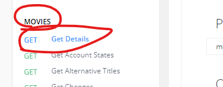
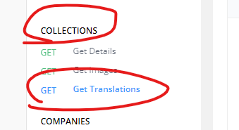
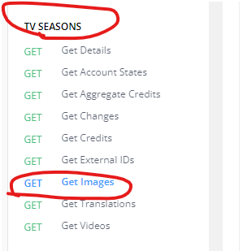

<h3 align="right">
<a href="https://github.com/wrapTMDB/wrapTMDB-go">Github page</a> |
<a href="https://pkg.go.dev/github.com/wrapTMDB/wraptmdb-go">pkg.go</a>  
</h3>


# WrapTMDB-Go  
<h3>
<p align="center">
<a href="README.md"> English </a>|
<a href="/docs/README_ja.md"> 日本語 </a>|
<a href="/docs/README_zh-tw.md"> 繁體中文 </a>|
<a href="/docs/README_zh-cn.md"> 简体中文 </a>
</p>
</h3>
<br/>

# What is [wrapTMDB](https://github.com/wrapTMDB/wrapTMDB) ?

```wrapTMDB``` is a wrapper collection for wrapping TMDB API from their doc and implementing in different program languages.

It helps developer to request Movies or TV shows for infomation and metadata.<br/>

This repo written by Golang and publich in pkg.go,<br/>
see more  [here](https://github.com/wrapTMDB/wrapTMDB).
___
## What kinds of projects are appropriated using with?

- If you want to make a client to track new movies infomation.
- If you want to make a tool helping you to manage your movie files or videos.
- Even if you want to make a application to replace TMDB offical website. (( lmao
- ...

___
## Useage

### Install:

```bash
$go get github.com/wrapTMDB/wrapTMDB-go
```

Before use this tool, make sure already have your [api_key](https://developers.themoviedb.org/3/getting-started/authentication).
<br/>

``` golang
package main

import (
	"fmt"
	wraptmdb "wraptmdb-go"
)

func main() {
	//initialize
	wraptmdb.Init("Your api_key")
	wraptmdb.SetHeader(map[string]string{
		"User-Agent": "wraptmdb-go dev",
		"Referer":    "wraptmdb-go",
	})
	//call function
	msg := wraptmdb.Movies.GetDetail("624860", "")

	fmt.Print(msg)
}

```
___

## How do I recognize these APIs ?

### with your intuition:

```golang
data := wrapTMDB.Movies.GetDetails("624860");
```


```golang
data := wrapTMDB.Collections.GetTranslations("654321", "en-US");
```


```golang
data := wrapTMDB.TVseasons.GetImages("54321", "65421", "en-US");
```



# Join Development ?
```bash
$git clone https://github.com/wrapTMDB/wrapTMDB-go &&
npm install ||
touch src/main.go
```

___
## Others

*** leave a star,  hope this tool would give you a big help. ***

THANK YOU :)

Any request are welcome.