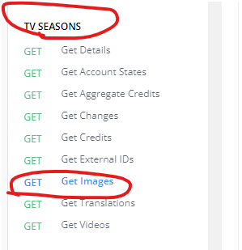

<h3 align="right">
<a href="https://github.com/wrapTMDB/wrapTMDB-go">Github page</a> |
<a href="https://pkg.go.dev/github.com/wrapTMDB/wraptmdb-go">pkg.go</a>  
</h3>


# WrapTMDB-ts  
<h3>
<p align="center">
<a href="README.md"> English </a>|
<a href="/docs/README_ja.md"> 日本語 </a>|
<a href="/docs/README_zh-tw.md"> 繁體中文 </a>|
<a href="/docs/README_zh-ch.md"> 简体中文 </a>
</p>
</h3>
<br/>

# [wrapTMDB](https://github.com/wrapTMDB/wrapTMDB) 是什麼?

```wrapTMDB``` 是一個包裝器集合，從TMDB的文檔中包裝  API 並以不同的程式語言實現。
它可以幫助開發者向TMDB要求電影或電視節目的信息和元數據。 <br/>

這個庫由 Golang 編寫並在 pkg.go 中發佈,<br/>
查看[更多](https://github.com/wrapTMDB/wrapTMDB).
___
## 什麼樣的項目適合使用？

- 如果您想製作一個客戶端能夠追踪新電影信息。
- 如果您想製作一個工具來幫助您管理電影文件或視頻。
- 甚至你想製作一個前端以取代TMDB的官方網站。 ((笑
- ...

___
## 使用方式

### Install:

```bash
$go get github.com/wrapTMDB/wrapTMDB-go
```

在使用此工具之前，請確保您已經擁有 [api_key](https://developers.themoviedb.org/3/getting-started/authentication).
<br/>

``` Golang
package main

import (
	"fmt"
	wraptmdb "wraptmdb-go"
)

func main() {
	//initialize
	wraptmdb.Init("Your api_key")
	wraptmdb.SetHeader(map[string]string{
		"User-Agent": "wraptmdb-go dev",
		"Referer":    "wraptmdb-go",
	})
	//call function
	msg := wraptmdb.Movies.GetDetail("624860", "")

	fmt.Print(msg)
}
```
___

## 我該如何識別這些 API ?

### 運用你的直覺:
```Golang
data := wrapTMDB.Movies.GetDetails("624860");
```


```Golang
data := wrapTMDB.Collections.GetTranslations("654321", "en-US");
```


```Golang
data := wrapTMDB.TVseasons.GetImages("54321", "65421", "en-US");
```



# 加入開發 ?
```bash
$git clone https://github.com/wrapTMDB/wrapTMDB-go &&

npm install ||

touch src/main.go
```

___
## 其他

*** 留個星星吧，希望這個工具能給你很大的幫助。 ***

THANK YOU :)

歡迎任何要求。